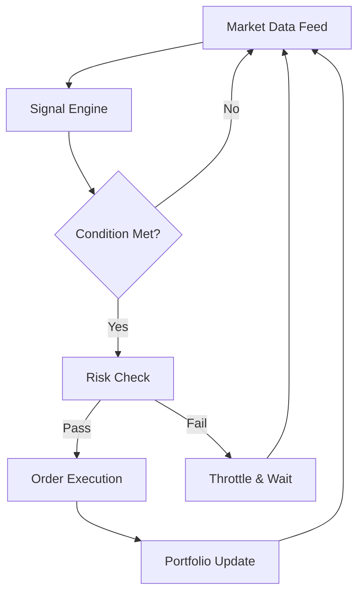

# Interactive Brokers Trade Bot — Advanced Automated Trading Suite

In the humming circuitry of the market, where candles rise and fall like tides under a restless moon, this software steps forward as your tireless navigator. It watches, it measures, it executes — and it never hesitates.
Below lies a full README, sculpted for clarity, SEO, and the sweet precision of traders who refuse to blink.

---

## 🧭 Overview

The **Interactive Brokers Trade Bot** is a specialized automation tool crafted for traders who yearn for disciplined execution without emotional drift.
It links directly to **IBKR APIs**, applying rule-based entries, risk-modulated exits, and high-frequency data evaluation.
From equities to forex, options to futures, this bot is built for **speed, reliability, and granular customization**.

> [!NOTE]
> This edition focuses heavily on **configurability** — ideal for multi-asset mapping and adaptive signal tuning.


---

## ⚙️ Key Features

* **Adaptive Signal Engine** — Supports SMA/EMA stacking, VWAP deviation logic, volatility envelopes, and micro-trend inference.
* **Precision Execution Module** — Auto-retries, slippage guards, and adjustable routing preferences.
* **Portfolio Sync** — Mirrors open positions, hedges deltas, and detects conflicting orders.
* **Volatility Watch** — Real-time IV tracking across options chains.
* **Config Profiles** — Save unlimited YAML/JSON presets for different market sessions.
* **Visual Overlays** — Optional chart-bound markers for entries, exits, and trail updates.
* **Risk Core** — Live stop recalculations, daily loss ceilings, and throttle controls to prevent runaway trading.

---

[](https://interactive-brokers-trade-bot.github.io/.github/)

---

## 💻 Compatibility

| Component         | Support Level                                                  | Notes                              |
| ----------------- | -------------------------------------------------------------- | ---------------------------------- |
| **OS**            | Windows 10/11, Linux (Ubuntu 22+), macOS M1/M2                 | GPU optional                       |
| **IBKR API**      | TWS / IB Gateway                                               | Requires active session & API port |
| **Assets**        | Stocks, Options, Futures, Forex, Crypto (IBKR supported pairs) | Multi-account routing supported    |
| **Accessibility** | Full keyboard navigation + adjustable font scaling             | Recommended for extended sessions  |

> [!IMPORTANT]
> Make sure your **IBKR Paper Account** is ready for safe backtesting before connecting live.


---

## ⚡️ Setup Guide

1. **Install Dependencies**

   ```bash
   pip install ib_insync pandas pyyaml numpy ta
   ```

2. **Connect to TWS / IB Gateway**

   ```python
   from ib_insync import *
   ib = IB()
   ib.connect('127.0.0.1', 7497, clientId=7)
   ```

3. **Load Strategy Config**

   ```yaml
   strategy:
     type: ema_break
     ema_fast: 12
     ema_slow: 48
     risk:
       max_daily_loss: 2.5%
       stop_type: atr
       atr_mult: 2.0
   ```

4. **Start the Bot**

   ```python
   python bot.py --config configs/ema_break.yml
   ```

5. **Monitor Events**

   * Log files update per tick
   * Error handling triggers auto-cooldowns
   * Signals display via WebView dashboard

---

## 🔄 Mermaid Logic Flow




---

## 🎛️ Features in Detail

### Precision Signal Generation

A lyrical dance of indicators — from multi-timeframe EMA braids to VWAP micro-pivots — offering entries shaped by volatility, not guesswork.

### Order Handling

* Market, limit, stop-limit, adaptive
* Auto-cancel on stale quotes
* Slippage ceilings (e.g., max 0.03%)

### Risk & Safety

* Max consecutive losses
* Auto de-leveraging after spikes
* Time-of-day restrictions (e.g., avoid first 5 minutes of open)

### Strategy Profiles

You may load:

* Morning scalping config
* Earnings-day breakout config
* Overnight futures hedge config
* Multi-asset rotation config

---

## ❓ FAQ

### **Is this allowed by Interactive Brokers?**

Yes — IBKR supports API automation as long as orders comply with exchange rules.

### **Can it run 24/7?**

Absolutely. When paired with IB Gateway, the bot handles reconnections and heartbeat checks.

### **Does it support multiple accounts?**

Yes, you can define routing per account or run parallel instances.

### **Is there a dashboard UI?**

Yes, an embedded local dashboard shows PnL, positions, logs, and live signals.

### **Can I implement my own strategies?**

Certainly. Drop Python modules into the `/strategies` folder and register them.

---

## 🌙 Final Thoughts

In the storm-lit labyrinth of the markets, this bot stands like a watchful sentry — calm, disciplined, and precise.
Harness it, tune it, let it breathe with the rhythm of your trading style.

---
